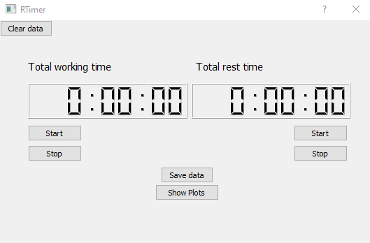

What's this code?
 
RTimer is a complete code that can help you to control your screen-time. GUI was written on PyQT5. Program records your time when you are working and when you are resting and then creating plots for last 7 and 30 days.

Main concepts

Project include this files:
1. main.py - file constructs the logic of all project. It connects all buttons, starts timers and stops them, allows to save data to the file and shows plots.
2. plots.py - file converts file's data (date and our working and rest time) to differnt lists and then making plots according it.
3. data.oil - file where data keeps. This is file helps to construct plots. You can't change due to safety of working project. All useful information shows in plots.
4. WorkToRest.py - file consists main design of project. There is size of buttons, position of timers, colors of the background e.c.
5. WorkToRest.ui - file of design of RTimer. You can use it to customize appearance.

After launching main.py you would see this window:

You have two couple of buttons under two timers.
First couple responds to Total Working Time, the second one for Total Rest Time. 
If you clicked at the "start" timer begin to raise up. 
If you clicked at the "stop" timer will stop. 
Timer can be reloaded after clicking on the "save data". 
This button responds to save data to 'data.oil' file and also reloads all timers. 
You can click at "show plots" button that will show you plots made by last 7 and 30 days. 
Button "Clear data" responds to delete file with your data.